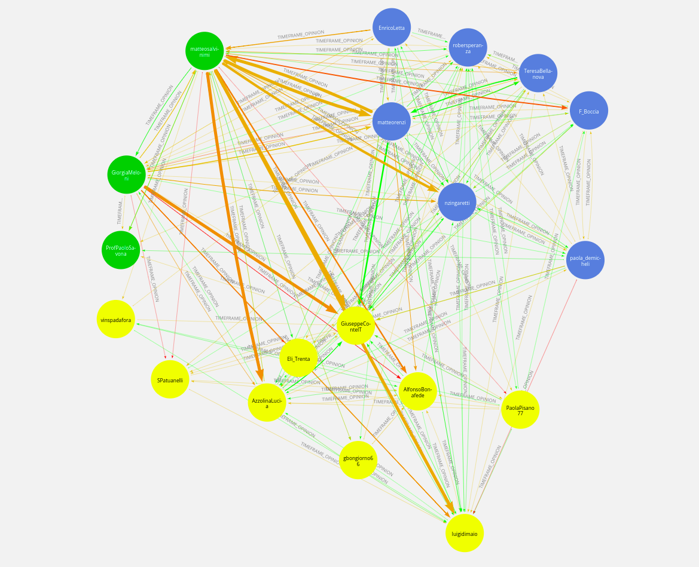

# USDE_project

The code contained in this repository scrapes the twitter accounts contained in the user_set file (see the data/user_set_example.json file) and adds them to a neo4j database. 

The way in which those nodes are inserted is pretty trivial: if in a tweet the program finds a reference to some other account in the user_set file (it may be the account name or any number of aliases) it adds a relationship that is structured like (user)-[:TWEETED_ABOUT]->(referenced account); note that before adding the tweet to the database, the content of said tweet is analyzed to understand its sentiment. 

Furthermore, the program reads from the timeframe file (see data/timeframe_example.json) which are the timeframe that are interesting to the user and aggregates the tweets of the users into relationships called "TIMEFRAME_OPINION", which display the average sentiment of a user regarding another during the selected period of time.

The sentiment is obtained through a fine tuned neural network whose training set included mostly football related italian tweets (https://huggingface.co/neuraly/bert-base-italian-cased-sentiment), so for english tweets the sentiment part should be modified. 

## Running the project
Compile the .env file and start up the Neo4j database, then run src/main.py. 

In case the files are already downloaded for some reason, run it with --tweetarchive [absolute path of the archive] to save time.

## Example of results

The following images were made using Neo4j Bloom. 

In the pictures the width of a relationship is given by the number of tweets in it, while the colour is given by the average opinion during the timeframe (red is bad, green is good).
I decided to select as timeframes four phases of the Conte governaments, as they show how the different parties change allegiances during time, and I divided the parties into three groups: Left, Movimento 5 Stelle and Right, that are coloured respectively in blue, yellow and green.

Conte I, from 15-05-2018 until 01-03-2019

Conte I, from 01-03-2019 until 20-08-2019

Conte II, from 25-08-2019 until 01-11-2020

Notice how before the Left (blue) had bad relationships with both M5s (yellow) and the Right(green), while the latter two had good relationships between each other. Now the reverse is happening: since the Left and M5S are governing together, they have good relationships and the Right is opposing them. 

Conte II, from 01-11-2020 until 26-01-2021

